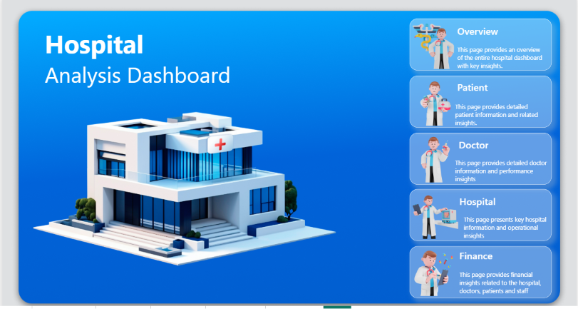
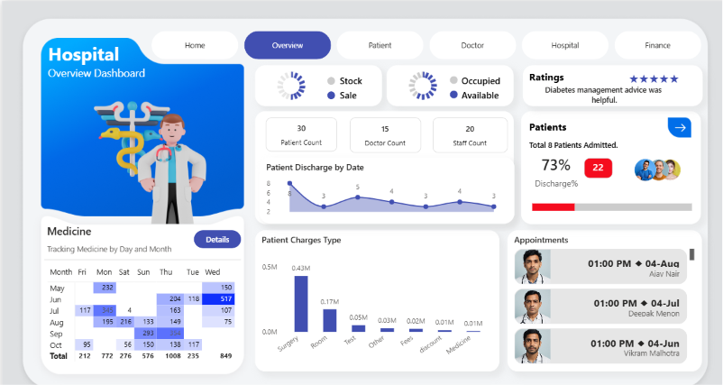
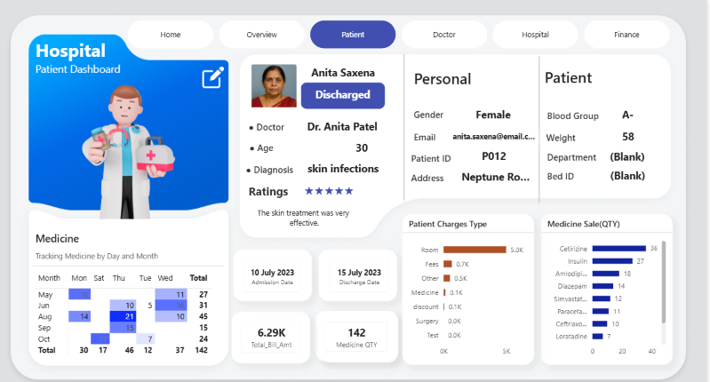
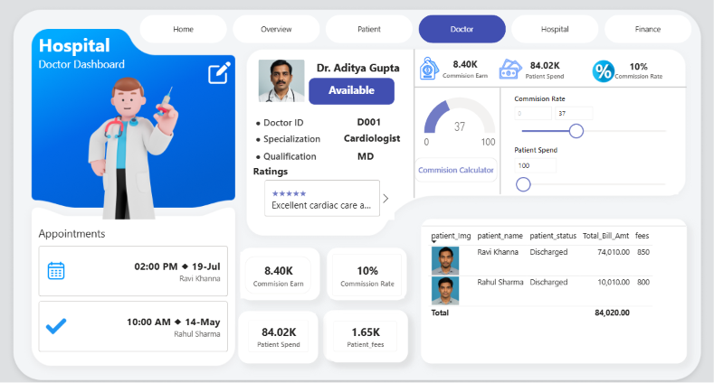
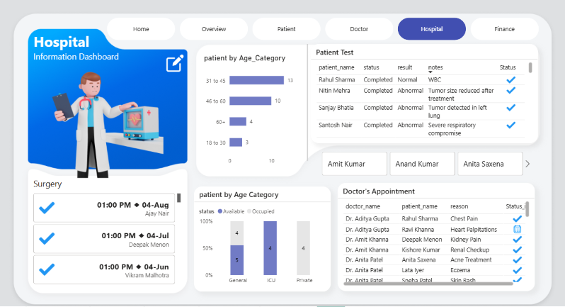
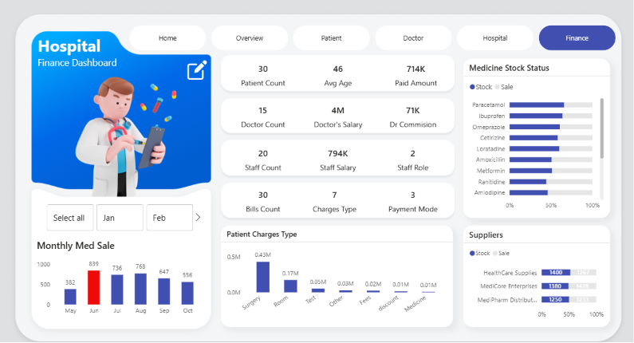

# Hospital Analysis Dashboard

<p align="center">
  
</p>

<h3 align="center">
End-to-End Healthcare Analytics Project using Power BI, MySQL & SQL
</h3>

<p align="center">
Interactive Business Intelligence Dashboard for Hospital Operations, Patient Analytics, Doctor Performance, and Financial Insights.
</p>

---

#  Project Overview

The Hospital Analysis Dashboard is an end-to-end Business Intelligence solution developed to analyze hospital operations using modern data analytics tools.

The project begins with importing raw hospital data into a **MySQL database**. To improve reporting performance and simplify analysis, **SQL Views** were created to remove unnecessary columns and prepare clean analytical datasets. These views were connected to **Power BI** through an **ODBC** connection, followed by data transformation in **Power Query**, data modeling, and **DAX** calculations to build an interactive multi-page dashboard.

This project demonstrates the complete analytics lifecycle—from database design to business reporting.

---

#  Project Workflow

```text
                   Raw Hospital Dataset
                            │
                            ▼
                    MySQL Database
                            │
                            ▼
              SQL Views (Data Preparation)
                            │
                            ▼
                    ODBC Connection
                            │
                            ▼
                  Power BI Desktop
                            │
                            ▼
             Power Query Transformations
                            │
                            ▼
               Star Schema Data Model
                            │
                            ▼
                  DAX Measures & KPIs
                            │
                            ▼
          Interactive Hospital Dashboard
```

---

#  Tech Stack

| Technology | Purpose |
|------------|---------|
| Power BI | Dashboard Development |
| MySQL | Database |
| SQL | Data Querying |
| SQL Views | Data Preparation |
| ODBC | Database Connectivity |
| Power Query | ETL |
| DAX | KPIs & Measures |
| Git & GitHub | Version Control |

---

#  Dashboard Preview

##  Home


---

##  Overview Dashboard

Provides a quick summary of hospital performance.

### Includes

- Hospital KPIs
- Patient Statistics
- Staff Summary
- Revenue Overview
- Appointment Trends
- Bed Availability



---

##  Patient Dashboard

Patient-level insights and treatment information.

### Includes

- Patient Details
- Admission & Discharge
- Medicine Details
- Billing Information
- Patient Charges
- Medicine Consumption



---

##  Doctor Dashboard

Analyzes doctor performance and commission.

### Includes

- Doctor Information
- Commission Earned
- Appointment Details
- Patient Fees
- Department Analysis



---

##  Hospital Dashboard

Operational analysis of hospital activities.

### Includes

- Surgery Schedule
- Patient Test Status
- Department Performance
- Doctor Appointments
- Age Distribution



---

##  Finance Dashboard

Financial performance analysis.

### Includes

- Paid Amount
- Staff Salary
- Doctor Salary
- Supplier Information
- Monthly Medicine Sales
- Medicine Stock



---

#  Database & SQL Work

This project uses MySQL as the backend database.

### Database Tasks

✔ Imported hospital datasets into MySQL

✔ Designed relational tables

✔ Created SQL Views

✔ Removed unnecessary columns

✔ Prepared reporting datasets

✔ Connected Power BI using ODBC

✔ Optimized data before visualization

---

# Key Features

- End-to-End BI Workflow
- Interactive Dashboard Navigation
- SQL-Based Data Preparation
- Power Query Transformations
- Star Schema Data Model
- DAX Measures
- Dynamic KPIs
- Interactive Slicers
- Professional Dashboard UI
- Multi-page Reporting

---

#  Skills Demonstrated

- Power BI
- SQL
- MySQL
- SQL Views
- ODBC Connectivity
- Power Query
- DAX
- Data Cleaning
- Data Transformation
- Data Modeling
- Dashboard Design
- Business Intelligence
- Healthcare Analytics

---

#  Repository Structure

```text
Hospital-Analysis-Dashboard
│
├── Dashboard
│   └── Hospital_Analysis_Dashboard.pbix
│
├── Images
│   ├── Hospital_Analysis_Dashboard.png
│   ├── Hospital_Overview_Dashboard.png
│   ├── Hospital_Information_Dashboard.png
│   ├── Doctor_Dashboard.png
│   ├── Patient_Dashboard.png
│   └── Finance_Dashboard.png
│
├── SQL
│   ├── create_tables.sql
│   ├── hospital_views.sql
│   └── database_schema.sql
│
└── README.md
```


#  Future Enhancements

- Real-Time Database Integration
- Row-Level Security (RLS)
- Automated Data Refresh
- Predictive Analytics
- KPI Alerts


# Author

Abhishek Mishra

 Email: abhhishek0101@gmail.com

 LinkedIn: https://linkedin.com/in/abhishek-mishra-ba80b1307

 GitHub: **https://github.com/abhhishek0101-m

## ⭐ If you like this project, consider giving it a Star!
